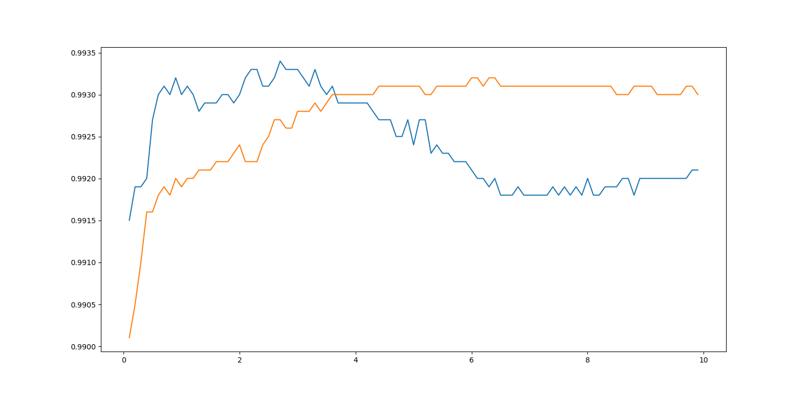

# CAR-PUF-Decoder
*Developing an SVM to decode a CAR-PUF and analyzing its performance across various parameter values.*

# Part 1. Reducing a CAR-PUF to a linear model
This part challenges the assumption that Companion Arbiter Physical Unclonable Functions (CAR-PUFs) are resistant to prediction by linear machine learning models. CAR-PUFs, composed of working and reference PUFs, rely on a secret threshold to determine responses based on timing differences.

Contrary to the belief in the complexity of predicting CAR-PUF responses, we demonstrate the existence of a linear model capable of perfect prediction, given sufficient challenge-response pairs (CRPs). Using data from a CAR-PUF with 32-bit challenges, our analysis shows that by transforming challenge vectors appropriately, a linear model can accurately predict CAR-PUF responses.

This part emphasizes the need for critical evaluation of security measures in PUF design and reveals the vulnerability of CAR-PUFs to linear model prediction.

## Introduction to PUFs and CAR-PUFs
**Physical Unclonable Functions (PUFs)** are hardware security primitives that exploit the inherent physical variations in manufacturing to generate unique, unpredictable responses to input challenges. These challenge-response pairs (CRPs) form the basis for secure identification and authentication systems. PUFs are valued for their lightweight nature and resistance to cloning or duplication, making them crucial for hardware-based security applications.

**Companion Arbiter PUFs (CAR-PUFs)** are an advanced variant of traditional Arbiter PUFs, designed to enhance security by combining two PUF instances: a working PUF and a reference PUF. The response is determined by comparing the delay differences from both PUFs against a secret threshold. This structure aims to increase the complexity of predicting responses, offering improved resistance to machine learning attacks. However, as this study shows, even CAR-PUFs can be vulnerable to sophisticated linear modeling techniques under specific conditions.

  

### Dataset
We show that there exists a linear model that can perfectly predict  the responses of a CAR-PUF and this linear model can be estimated fairly accurately if given enough challenge-response pairs (CRPs). We have data from a CAR-PUF with 32-bit challenges. The training set consists of 40000 CRPs and the test set consists of 10000 CRPs.

## Calculations
Suppose the secret time threshold is $\tau$ and the delays from the two PUFs are $\Delta_{w}$ and $\Delta_{r}$. The CAR-PUF outputs 1 if $|\Delta_{w} - \Delta_{r}| > \tau$ and 0 otherwise.

Therefore, the classifier model is given by:

$$
\text{model output} = (1+\text{sign}(|\Delta_{w} - \Delta{r}|-\tau))/2
$$

, where the *sign* function is:

$$
\text{sign}(x) = 
\begin{cases} 
-1 & \text{if } x < 0 \\
0 & \text{if } x = 0 \\
1 & \text{if } x > 0
\end{cases}
$$

From this, we conclude that the decision boundary should be:

$$
|\Delta_{w} - \Delta_{r}|-\tau = 0
$$

or, $|\Delta_{w} - \Delta_{r}|=\tau$. Squaring both sides, we get:

$$
|\Delta_{w} - \Delta_{r}|^{2}=\tau^{2}
$$

Expanding the terms:

$$
\Delta_{w}^2 - 2 \Delta_{w} \Delta_{r} + \Delta_{r}^2 - \tau = 0
$$

If $\textbf{X} \in \mathbb{R}^{32}$ denotes the feature vectore (challenge), we can model the time delays as follows:

  $$
  \Delta_{w} = \tilde{W}_{w}^{T} \mathbf{X}
  \Delta_{r} = \tilde{W}_{r}^{T} \mathbf{X}
  $$

, where $\tilde{W}_{w}^{T} \in \mathbb{R}^{32}$.

Now let us represent the Linear model $\Delta_{r}$ with the parameters $(\mathbf{u}, p)$ and $\Delta_{r}$ with parameters $(\mathbf{v}, q)$.
We note that $\mathbf{u}, \mathbf{v} \in \mathbb{R}^{32}$ and $p, q \in \mathbb{R}$.

Substituting in the equation for the decision boundary, we get:  

$$
(\mathbf{W}_w^T \mathbf{X})^2 - 2 \cdot (\mathbf{W}_w^T \mathbf{X}) \cdot (\mathbf{W}_r^T \mathbf{X}) + (\mathbf{W}_r^T \mathbf{X})^2 - t^2 = 0
$$

In order to further simplify it, we can represent the 32-dimensional parameters $\mathbf{u}$ and $\mathbf{v}$ as:  

$$
\mathbf{u} = (u_1, u_2, \ldots, u_{32})
$$

$$
\mathbf{v} = (v_1, v_2, \ldots, v_{32})
$$

$$
\mathbf{X} = (x_1, x_2, \ldots, x_{32})
$$

Expanding all of the terms, we get:

  $$
  (\mathbf{W}_w^T \mathbf{X})^2 = \sum_{i=1}^{32} u_i^2 x_i^2 + p^2 + \sum_{i=1}^{32} \sum_{j=i+1}^{32} u_i u_j x_i x_j + 2p \sum_{i=1}^{32} u_i x_i
  $$

  $$
  (\mathbf{W}_r^T \mathbf{X})^2 = \sum_{i=1}^{32} v_i^2 x_i^2 + q^2 + \sum_{i=1}^{32} \sum_{j=i+1}^{32} v_i v_j x_i x_j + 2q \sum_{i=1}^{32} v_i x_i
  $$

  $$
  (\mathbf{W}_w^T \mathbf{X})(\mathbf{W}_r^T \mathbf{X}) = \sum_{i=1}^{32} u_i v_i x_i^2 + 2pq + \sum_{i=1}^{32} \sum_{j=i+1}^{32} (u_i v_j + v_i u_j) x_i x_j + 2p \sum_{i=1}^{32} v_i x_i + 2q \sum_{i=1}^{32} u_i x_i
  $$

Thus, the decision boundary equation becomes:

  

$$
\Rightarrow \sum_{i=1}^{32} (u_i - v_i)^2 x_i^2 + \sum_{i=1}^{32} \sum_{j=i+1}^{32} (u_i + v_i)(2u_j - v_j)x_i x_j + 2(p - q) \sum_{i=1}^{32} (u_i - v_i)x_i + \big[(p - q)^2 - t^2\big] = 0
$$

Now, $x_i = 1$ or $x_i = -1$ are the possible values. So, when we use $x_i^2$, we actually convert all these values to 1. Thus, the 32 terms of $x_i^2$ are all added to the bias term and become the new bias term.  
The new decision boundary thus becomes:

$$
\sum_{i=1}^{32} \sum_{j=i+1}^{32} (u_i + v_i)(2u_j - v_j)x_i x_j + 2(p - q) \sum_{i=1}^{32} (u_i - v_i)x_i + \big[(p - q)^2 - t^2 + c\big] = 0
$$

where $c$ represents $\sum_{i=1}^{32} (u_i - v_i)^2 x_i^2$.  

Here, the first term has $(31 \cdot 32) / 2 = 496$ dimensions and the second term has 32 dimensions.

Thus, we can represent the above decision boundary with the help of a linear model in 528 dimensions.

## Conclusion:-
Thus, the linear classifier model is given by the equation-

$$
(1 + \text{sign}(\mathbf{W}^T \phi(\mathbf{c}) + b))/2 = r
$$

, where $\mathbf{W} \in \mathbb{R}^{528}$ is the weight matrix, $b \in \mathbb{R}$ is the bias term, $\mathbf{c} \in \{0, 1\}^{32}$ contains the challenge and $r \in \{0, 1\}$ is the response.

Also, the term $\phi(\mathbf{c})$ is given as:

$$
\phi(\mathbf{c}) = \{c_i c_j \,|\, c_i, c_j \in \mathbf{c} \text{ and } i < j\} \cup \mathbf{c}
$$

# Part 2. Linear Model Analysis
This part investigates the outcomes of utilizing the sklearn.svm.LinearSV and sklearn.linear_model.LogisticRegression methods for learning the behaviour of CAR-PUFs given some data of challenge-response pairs. Impacts of various hyperparameters, including the loss function, C value, tolerance, and penalty type, on accuracy and training time were explored. Results are presented through tables and charts, representing the effects of these hyperparameters on model performance across both SVM-LinearSVC and Logistic Regression methods.

All the tests were done on a private CPU with the following specifications:  
**Processor**:  
12th Gen Intel(R) Core(TM) i5-1235U 1.30 GHz  
**RAM**:  
8.00 GB  

## 1. Results obtained from Linear SVC
In this section, we performed training on our dataset utilizing the *sklearn.svm.LinearSVC()* method. Optimal parameters for least accuracy loss and training time can be easily inferred from the following data.

### 1.1 Performance
Modelling the data using **SVM-LinearSVC**, resulted in prediction accuracy of 99.3% on the "test" dataset and an average training time of about 2.53 seconds on the "train" dataset.

### 1.2  Hyperparameter Tuning
99.3% accuracy was achieved for the default hyperparameters. However, improvement in accuracy was observed for some non-default values. A clear trend can be observed between the performance and the values of hyperparameters of the models. The plots below provides the details of these:-

+ **Changing the *loss* hyperparameter**

  *sklearn.SVC* provides two types of losses- ”hinge” and ”squared_hinge”(default value). The hinge loss can only be used for dual problem. However, hinge fails to converge for the data even for 1000 iterations and any reasonable tolerance value.

  Following are the performance characteristics of LinearSVC for both loss values:
  <table align='center'>
    <tr>
      <td><b>Loss Function</b></td>
      <td><b>Accuracy (in %)</b></td>
      <td><b>Training Time (in s)</b></td>
    </tr>
    <tr>
      <td><b>Hinge Loss</b></td>
      <td>88.46</td>
      <td>6.7092147</td>
    </tr>
    <tr>
      <td><b>Squared Hinge Loss</b></td>
      <td>99.34</td>
      <td>2.88874742</td>
    </tr>
  </table>
  It is easy to observe that <i>squared_hinge</i> performs better than <i>hinge</i> loss function. The high training time for <i>hinge</i> loss is because the model failed to converge for hinge loss.
  Note that the data is for regularization parameter set to its optimal value (C=2.7).

+ **Setting C to high/low/medium values**

  The regularization parameter, C controls the trade-off between maximizing the margin and minimizing the classification error. The value of C is set to 1 by default for LinearSVC. The
following trend is observed in the performance of the model for varying values of C-
  <table align='center' style="width:100%; table-layout:fixed; border:0; margin-left:auto; margin-right:auto;">
    <tr>
      <td style="text-align:center; border:none;">
        
      </td>
      <td style="text-align:center; border:none;">
        
      </td>
    </tr>
    <tr>
      <td style="text-align:center; border:none;">Figure 2. Training Time vs C</td>
      <td style="text-align:center; border:none;">Figure 3. Accuracy vs C</td>
    </tr>
  </table>

  From the above graph it is readily observed that the accuracy of the model first increases with the value of C, peaks around at about C=2.7 with accuracy of 99.34% and then drops down.
  On the other hand, there is only a small increase in training time for increasing values of C. The random peaks in the graph might be due to the randomness of the system and not indicative of the model’s reaction to change in C value.

+ **Changing tol to high/low/medium values**
  The tolerance value signifies the threshold at which the convergence iteration ceases, indicating the stage where we ascertain that our classifier has converged. The value of tolerance is set to 10−4 by default. The Training time and Accuracy with **negative logarithm of Tolerance values** are plotted below.
  <table align='center' style="width:100%; table-layout:fixed; border:0; margin-left:auto; margin-right:auto;">
    <tr>
      <td style="text-align:center; border:none;">
        
      </td>
      <td style="text-align:center; border:none;">
        
      </td>
    </tr>
    <tr>
      <td style="text-align:center; border:none;">Figure 4. Training Time vs Tolerance</td>
      <td style="text-align:center; border:none;">Figure 5. Accuracy vs Tolerance</td>
    </tr>
  </table>
  The above plots clearly show that the optimised value with respect to accuracy of tolerance is the default value which is $10^{−4}$. Also, it is clear that the training time increases as well as we keep on reducing the tolerance value.

+ **Changing the penalty (l2 vs l1)**
  *svm.LinearSVC* provides two types of penalties- l1, which is absolute loss, and l2, which is squared loss. l2 penalty is usually set as the default penalty parameter for sklearn models. The model’s convergence was unsuccessful when applying the l1 penalty, but switching to the l2 penalty facilitated successful convergence.
  
  <table align='center'>
    <tr>
      <td><b>Penalty</b></td>
      <td><b>Accuracy (in %)</b></td>
      <td><b>Training Time (in s)</b></td>
    </tr>
    <tr>
      <td><b>l1 Penalty</b></td>
      <td>99.16</td>
      <td>95.64494492</td>
    </tr>
    <tr>
      <td><b>l2 Penalty</b></td>
      <td>99.34</td>
      <td>2.72156618</td>
    </tr>
  </table>

  Using l1 penalty drastically increases the training time of the model without any significant increase in the accuracy. l2 penalty, on the other hand, had decidedly smaller training time and greater accuracy. Therefore, l2 penalty is undeniably the better choice of the two.

## 2. Results obtained from Logistic Regression
Repeating all the above steps, but with *LogisticRegression* instead of *svm.LinearSVC* yields the following results. The accuracy obtained on the ”test” after fitting to the ”train” data was 99.28% with the default hyperparameters. This result is comparable with the one obtaied with LinearSVC classifier. This means now our model was able to classify 9928 data points correctly out of the given 10000 points.

### 2.1 Accuracy Score
Again as previous, the obtained 99.28% accuracy is on the hyperparameters set as default, which is comparable to the accuracy achieved by using svm model. However, the training time required by logistic regression is significantly less than that of svm at around 0.95 seconds.

### 2.2  Hyperparameter Tuning
The achieved 99.3% accuracy was based on the default hyperparameters. The plots below provides the details of these:-

+ **• Setting C to high/low/medium values**
  At default tolerance value, we set C to various range of values. However, the highest possible accuracy was reached when C was set to 6.0. It is observed that the accuracy of the model increases with increase in value of C at first and then reaches maximum at around C=6.0 after which it remains constant.
  <table align='center' style="width:100%; table-layout:fixed; border:0; margin-left:auto; margin-right:auto;">
    <tr>
      <td style="text-align:center; border:none;">
        
      </td>
      <td style="text-align:center; border:none;">
        
      </td>
    </tr>
    <tr>
      <td style="text-align:center; border:none;">Figure 6. Training Time vs C</td>
      <td style="text-align:center; border:none;">Figure 7. Accuracy vs C</td>
    </tr>
  </table>

+ **Changing tol to high/low/medium values**
  The tolerance value was set to different values and its training time and accuracy was plotted. For a better visualisation purpose, we plotted these on the negative logarithmic of tolerance scale.The highest accuracy was obtained when tol was set to $10^{-4}$.
  <table align='center' style="width:100%; table-layout:fixed; border:0; margin-left:auto; margin-right:auto;">
    <tr>
      <td style="text-align:center; border:none;">
        
      </td>
      <td style="text-align:center; border:none;">
        
      </td>
    </tr>
    <tr>
      <td style="text-align:center; border:none;">Figure 8. Training Time vs Tolerance</td>
      <td style="text-align:center; border:none;">Figure 9. Accuracy vs Tolerance</td>
    </tr>
  </table>

+ **Changing the regularization hyperparameter in (l2 vs l1)**
  When we used the l1 regularization parameter, the model did not converge. It converged only when we used the l2 regularization parameter. Also, the standard sklearn library, only allows the use of l1 penalty with "saga" solver.
  <table align='center'>
    <tr>
      <td><b>Penalty</b></td>
      <td><b>Accuracy (in %)</b></td>
      <td><b>Training Time (in s)</b></td>
    </tr>
    <tr>
      <td><b>l1 Penalty</b></td>
      <td>99.04</td>
      <td>20.9712754</td>
    </tr>
    <tr>
      <td><b>l2 Penalty</b></td>
      <td>99.32</td>
      <td> 0.9552411</td>
    </tr>
  </table>

  It is evident that l1 penalty requires significantly more time and also performs poorly in accuracy in comparison to l2 penalty. Thus, l2 penalty is decidedly better for Logistic Regression also.

## 3. Comparison of the Hyperparameters from both the Classifiers
In this section, we will compare the results, namely the accuracy and the training time from both of our classifiers.

+ **Modifying the C Hyperparameter**
   <table align='center' style="width:100%; table-layout:fixed; border:0; margin-left:auto; margin-right:auto;">
    <tr>
      <td style="text-align:center; border:none;">
        
      </td>
      <td style="text-align:center; border:none;">
        
      </td>
    </tr>
    <tr>
      <td style="text-align:center; border:none;">Figure 10. Training Time vs C</td>
      <td style="text-align:center; border:none;">Figure 11. Accuracy vs C</td>
    </tr>
  </table>

+ **Modifying the tolerance value** (Negative log tolerance is plotted on the x-axis)
  <table align='center' style="width:100%; table-layout:fixed; border:0; margin-left:auto; margin-right:auto;">
    <tr>
      <td style="text-align:center; border:none;">
        
      </td>
      <td style="text-align:center; border:none;">
        
      </td>
    </tr>
    <tr>
      <td style="text-align:center; border:none;">Figure 12. Training Time vs Tolerance</td>
      <td style="text-align:center; border:none;">Figure 13. Accuracy vs Tolerance</td>
    </tr>
  </table>

## 4. Conclusion
After comparing both of our models, we’ve observed that their performance is comparable in terms of accuracy. However, when considering training time, we find that Logistic Regression outperforms Linear SVC in this scenario.
